# Summary of Access Control Security

## 1 	Overview Access Control and Reference Monitor  

- Where security engineering meets computer science
- Function: controls which principals (persons, processes, machines,…) have access to which resources in a system
- **Reference Monitor**
  - Scenario:

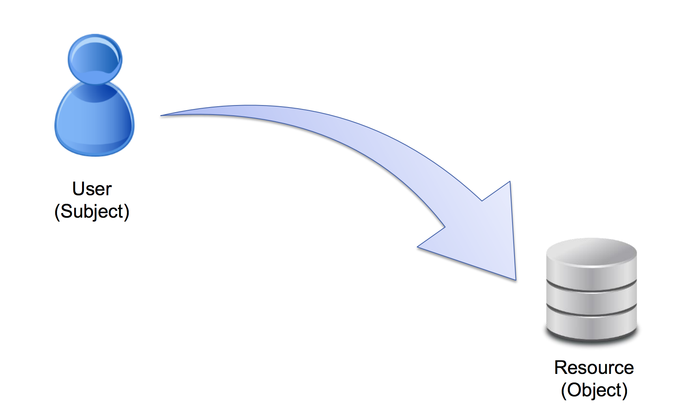

​	Access Control: 

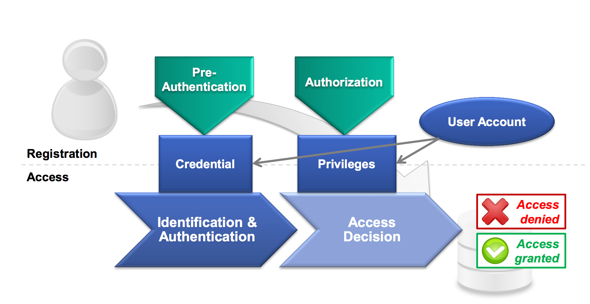

- **Access Control Matrix**
  - Möglichkeit zur Umsetzung von Identitätsbasierter Zugriffskontrolle zum Zeitpunkt **t** (**PROTECTION STATE**)
  - **Zeilen der Matrix**: beschreiben Principals
  - **Spalten**: Beschreiben Ressourcen
  - In Zellen stehen Rechte, welche ein Subjekt auf eine Ressource erhält
  - **ABER**: In der Praxis wenig geeignet: Datenstruktur sehr ineffizient $\rightarrow$ ACM ist groß, aber dafür sehr dürftig

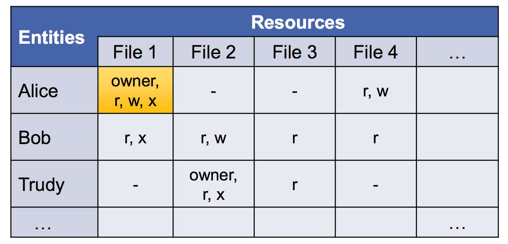

- Implementierungsmöglichkeiten:
  - *Capability Lists (CLs)*
  - *Access Control Lists (ACLs)*
- **Capability Lists (CLs)**
  - *Implementierungsmöglichkeit* für ACM
  - **Subject-oriented View**: Access privileges are stored together with the subject (rows are stored)
  - Only few implementations (e.g. from IBM) $\rightarrow$ determining all access privileges on an object is expensive $\rightarrow$ determining and delegation of access privileges is easy for single entities 

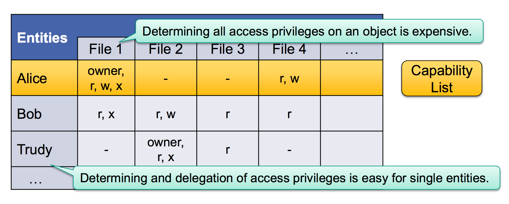

- **Access Control Lists (ACLs)**
  - *Implementierungsmöglichkeit* für ACM
  - Object-oriented view: Access privileges are stored together with the object
  - Gegensatz zu CLs
  - Determining and revoking of access privileges can be implemented efficiently $\rightarrow $ Determining all privileges of an entity can be expensive
  - Used by common systems

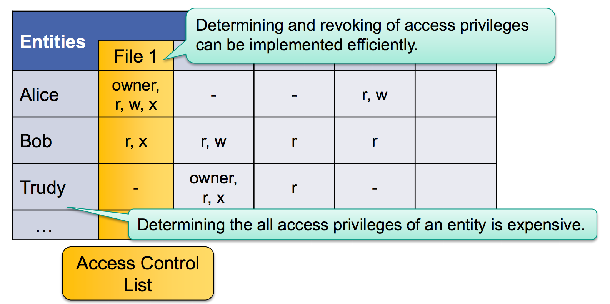

- **AC Strategies and Methods**

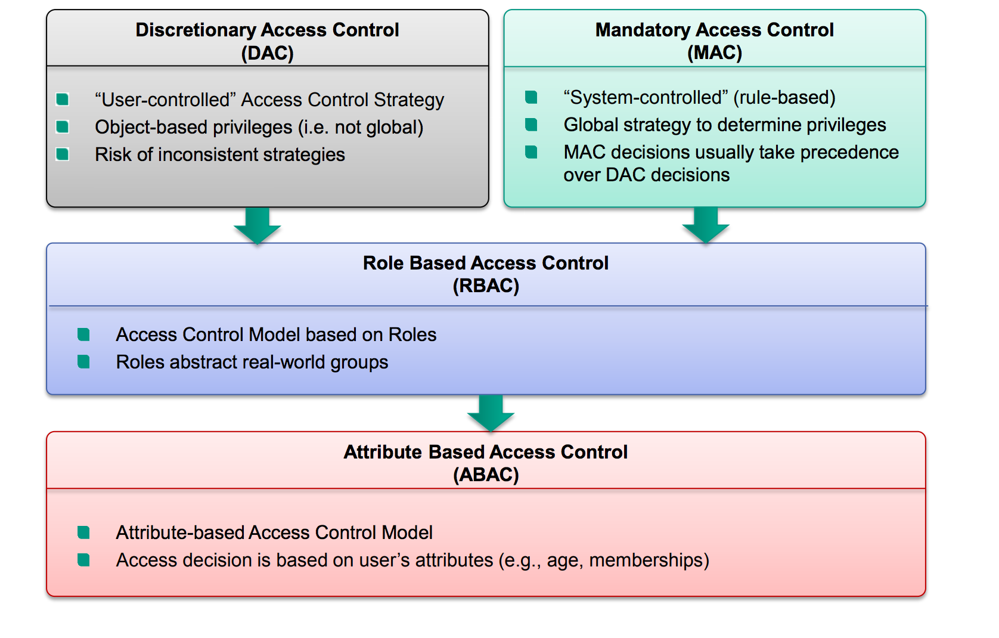

- **Access Control Complexity**

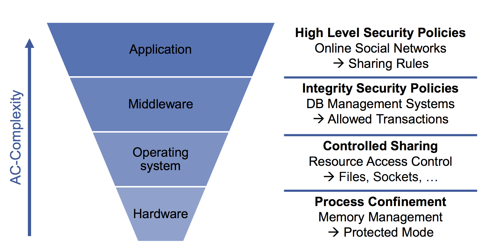


- **OS Access Control**

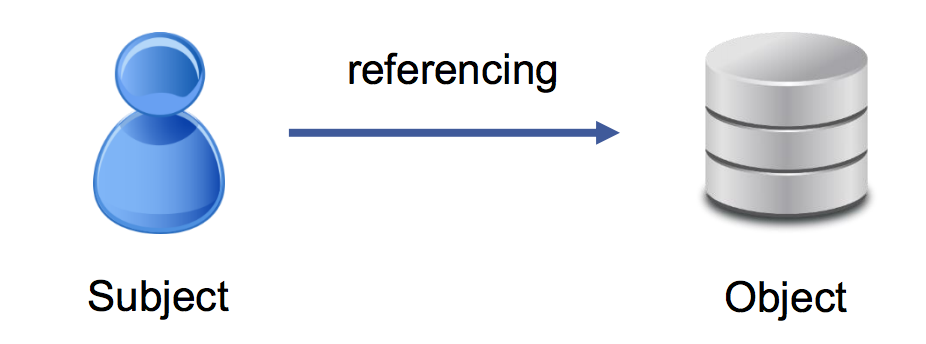

- Subject = Process executed on behalf of a user
- Object = Resource (File, peripherals, memory, ...)
- Goal: Controlled sharing of resources
  - **Execution control** -> Intercept accessing of resources
  - **Authorization Mechanism** -> Verify access regarding security policy

$\rightarrow$ Reference Monitor Concept

- **Reference Monitor**

  - Implementation has to comply with:

      - **Evaluable** - small enough to be subject to analysis
      - **Always invoked** - no alternative access control method
      - **Tamper-proof** - Mechanism cannot be altered

  - Erweitertes Konzept:
    - **Authorization DB** - Authorization Informationen 
    - **Monitor Interface** - Set of controlled operations
    - **Audit trails** - Traceability of access decisions

- **Implementation - Security Kernels** 

  - Reference Validation Mechanism (RVM) or **Security Kernel**

    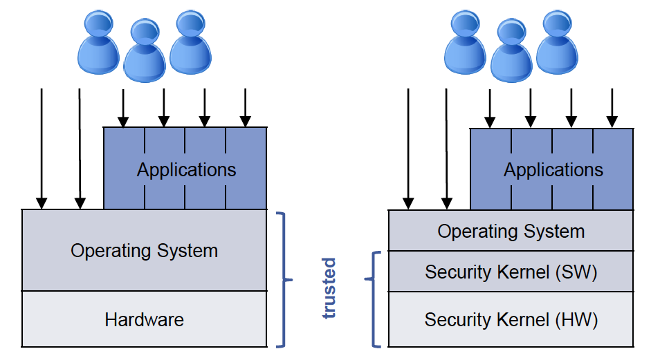

  - single most often used technique for building highly secure OS

  - But does not mean that it is always in all security systems or that most people agree that the security kernel is the right way to go

  - Opinion of most researchers: wrong approach

  - But to date has shown more promise than any other technique

- **Hardware Support**

  - Problem: prevent processes to override each others code/data

  - Architecture specific mechanisms:

    - Hierarchical protection domains 

    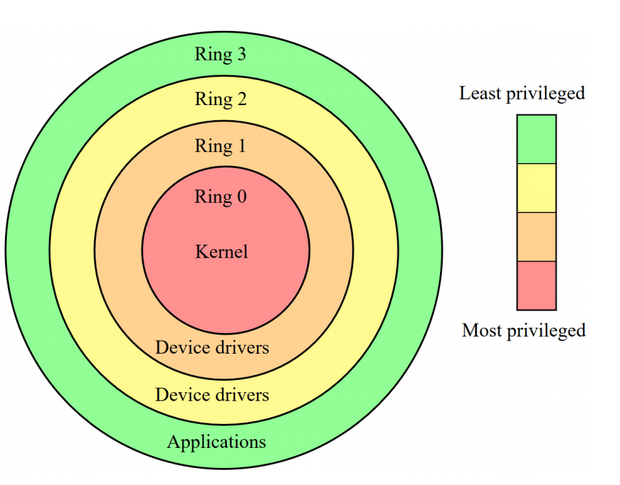

    - Segment addressing

    - preemtive multitasking

  - -> visualize resources


Implementing OS-Level Access Control using a RM, the OS as well as HW is required to provide according primitives.

- **Software: Linux**
  - Linux = POSIX reimplementation -> insufficient security mechanisms
  - Variaty of extensions: implementing different AC Models proposed for upstream integration
  - **Linux security Modules (LSM)**
    - Hooks -> Reference Monitor Interface
    - Kernel Module -> Reference Monitor Implementation
  - Examples for Implementations: AppAmor, SELinux, Smack, TOMOYO, Yama, ...
- *Linux Security Modules*


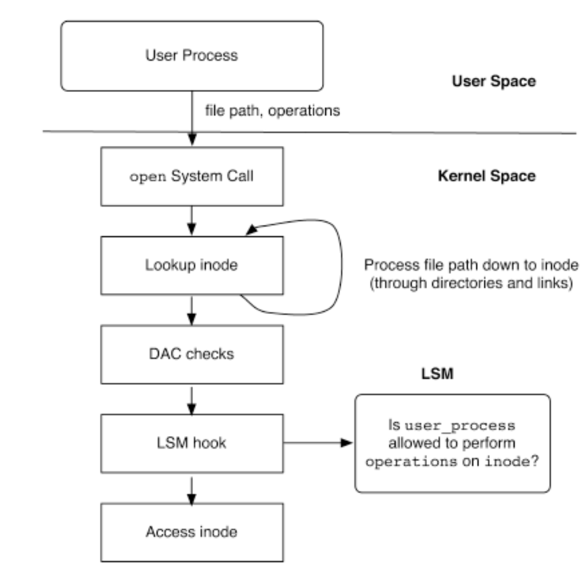


- **Extended Hardware Support - Intel SGX**
  - Traditional ring approach protects:
    - OS from apps
    - Apps from each other

  - -> A single OS vulnerability may corrupt the whole system

  - *Intel Software Guard Extensions (**SGX**)*
    - Set of extensions to Intels architecture
    - **Goal**: aims to provide **integrity** and **confidentiality** guarantees to security-sensitive computation performed on a computer where all the privileged software (kernel, hypervisor,…) is potentially malicious

  - SGX = 'reverse Sandbox' -> protecting apps from system

  - **Enclave** = HW-protected memory region
    - may contain executable code & data
    - runs subset of instructions (e.g. no syscalls)

  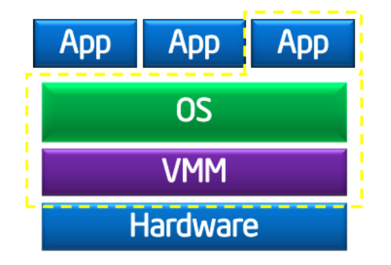

  - **Unaddressed attack vectors**

    - cache timing attacks

    - microcode attacks

    - physical attacks

    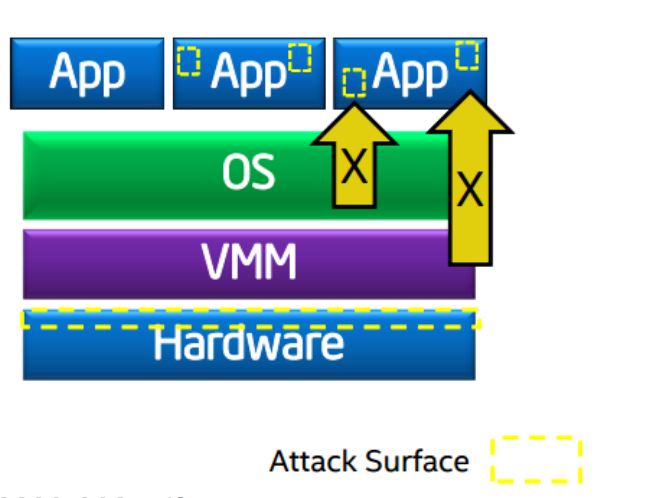

  - HW-enforced Security requires:

    - trusted computing base
    - HW secrets
    - remote attestation
    - Sealed storage
    - memory encryption

  - Warnung:

    - Intalling enclaves requires intels license
    - Enclaved SW cannot be analyzed or monitored

  - possible use cases for Intel SGX

    - Numecent -> Digital Rights Management (DRM)
    - Synaptics -> Biometric Matching 
    - Bromium -> Password Manager

### Summary

- To implement a RM a trusted computing base is needed. IN ease of os-level AC this requires software primitives (e.g. LSM) as well as Hardware support (e.g. protection rings).
- A common approach for OS-level Access Control implementations are Security Kernels, aiming at a reduction of the attack surface.
- Recent development: Intel SGX implements secure enclaves to run code in potentially malicious environments while providing integrity and confidentiality guarantees.


## 2 Access Control Matrix

- **Protection State**: consists of all active and passive components and their privileges over each other
- -> ACM encodes protection state and formalizes changes (over time) as simple as possible -> Commands
- ACM can model:
  - Function call permissions in programs
  - Data access in DB
  - Role-based access models
  - allows model over time
- primitive **Operations**:
  - **create** subject *s*; create object *o*
  - **destroy** subject *s*;destroy object *o*
  - **enter** r into A[s,o]
  - **delete** r from A[s,o]
- duplicate operation does not have any effect on A
- Commands

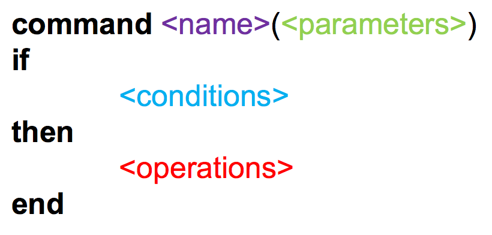

- only conjunctions $\wedge$ are allowed

- only single condition: *Mono-condional*

- only single operation: *Mono-operational*

  ​

- E.g. *Create file*

```
command make.file(p, f)
	create object f;
	enter own into A[p,f];
	enter r into A[p,f];
	enter w into A[p,f];
end
```

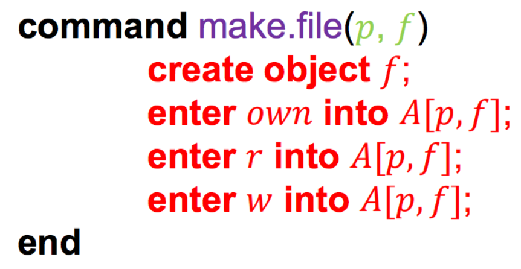

- Grant Rights to File

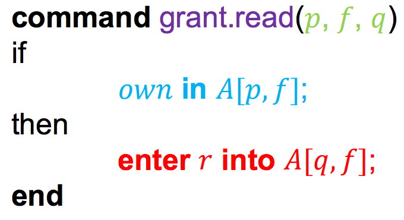

- **State Transitions**: Represents changes to the transition state ($X_i \vdash _\tau X_{i+1}$ / $X_i \vdash ^* X_{i+1}$)
- **LEAK:** Adding a generic right *r* where there was not one before is called leaking.
- **SAFE:** If a system S, beginning in initial state $s_0$, cannot leak right *r*, it is safe with respect to right *r*.
- **Safety Question**: Does there exist **one** algorithm for determining whether an arbitrary protection system S with initial state $s_0$ is safe with respect to a generic right *r*?
  - **Mono-operational commands: Safety Question is decidable **
    - *Sketch of proof*
      - Consider minimal sequence of commands to leak a right
      - Show that even in the worst case the sequence length is bounded by a polynomial
  - General Case: ***Safety Question is undecidable***! 
    - *Sketch of proof*
      - Simulate Turing Machine on ACM (**Diagonale**)
      - Only one "state" right at any given time in ACM
      - The TM entering halting state $q_f$ equates to right $q_f$ leaking
      - Reducing Safety Question to Halting Problem
      - *Conclusion*: Safte Question is undecidable 
      - Safety Question is complete in P-SPACE
      - Remove **delete**, **destroy** -> safety question remains undecidable -> such system is called monotonic 
      - Safety question for monoconditional protection systems with **create**, **enter**, **delete** (but no destroy) is decidable
- Important
  - A **Leak** is defined as a right appearing in a cell of the ACM - A system without Leaks is **Safe**
  - Determining the safety of a general system algorithmically is equivalent to the **Halting Problem ** and is therefore **undecidable**. It becomes decidable for restricted cases 

## 3 RBAC and Role Mining

- Permission
  - Is an approval of particular mode of access to one or more objects in a system
  - Allways a positive term
  - Allows the holder to perform some actions in the system
  - From very coarse grain to very fine grain

- Many Users share same (or very similar) permission set

- **Idea:** reduce complexity by assigning users to roles and roles to permissions

- **Facing problems:**
  - Complexity of security administration in large systems
  - reduces costs

- RBAC similar to functions a user is allowed to perform within an organization

- Differences between DAC and RBAC
  - User cannot pass access permission to other users at their discretion

- Role: Job function within an organization

- **Security principles that can be modelled by RBAC**
  - Least privilege
  - Speration of duties
  - Dual control
  - Data abstraction

- Limitations: cannot control sequence of operations

- Roles vs Groups

  - Groups: Collection of users (not of permissions)
  - Role: Collection of users AND of permissions
  - Role as intermediary to bring these two collections together
  - Role characteristics:
    - approcimately easy to determine role membership and role permissions
    - Control of role membership and role permissions should be relatively centralised in a few users
  - Many mechanisms fail in one or both characterstics

- Types: RBAC, RBAC1, RBAC2

  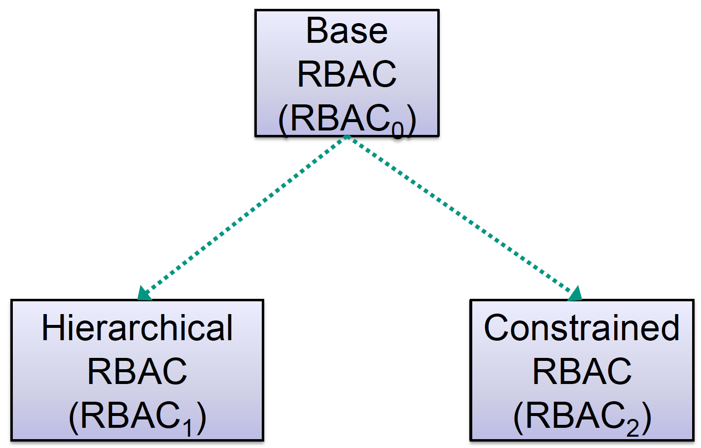

- **$RBAC_0$**

  - RBAC =(U, R, P, S, PA, UA, user, roles)
    - *user*: S -> U
    - *roles*: S -> $2^R$ 
  - Support least privilege by allowing users to login to a system with only those roles appropriate for given occasion (-> Session)
    - A user who is a member of a powerful role can normally keep this role deactivated and explicity activate it when needed
  - Session
    - Each session is mapping of one user to possibly many roles

- $RBAC_1$

  - Hierarchical RBAC
  - Hierarchies are a natural means of structuring roles to reflect an organization's lines of authority and responsibility 
  - similar to RBAC: No changes to RBAC(U, R, P, S, PA, UA, user)
    - BUT: Additionally 
      - **RH  $\subseteq$ R x R** is a partial order on R called the role hierarchy or role dominance relation, also written as $\ge$ 
      - $roels: S \rightarrow 2^R$ is modified from RBAC_0 to require $role(s_i) \subseteq \{r | (\exists r' \ge r)[user(s_i) \in UA]\}$  (which can change with time) and session $s_i$ has the permission $\cup _{r \in roles(s_i)} \{p | (\exists r'' \le r) [(p,r'') \in PA]\}$ 
  - Hierarchies are partial orders:
    - Reflexive: a role inherits its own permissions
    - Transitive: allows real hierarchies  
    - Antisymmetric: Two roles can't inherit each other

- $RBAC_2$

  - Also constrained RBAC 
  - Unchanged from RBAC_0 
    - Except fro requiring that there be a collection of constraints that determine whether or not values of various components of R_0 are acceptable
    - Only acceptable values will be permitted
  - Most frequently constraint: mutually exclusive roles
    - Supports seperation of duties
  - Example for constraints: 
    - Same user can be assigned to at most one role in a mutually exclusive set
    - A role can have a maximum number of members
  - Implementation as
    - Constraints - *give restrictions to RBAC state*
    - Prequisite conditions -  *give restrictions to RBAC state changes* 

- **Administrative Model**

  - Who is allowed to change RBAC state

  - ARBAC97: use "administrative roles" to assign administrative permissions

    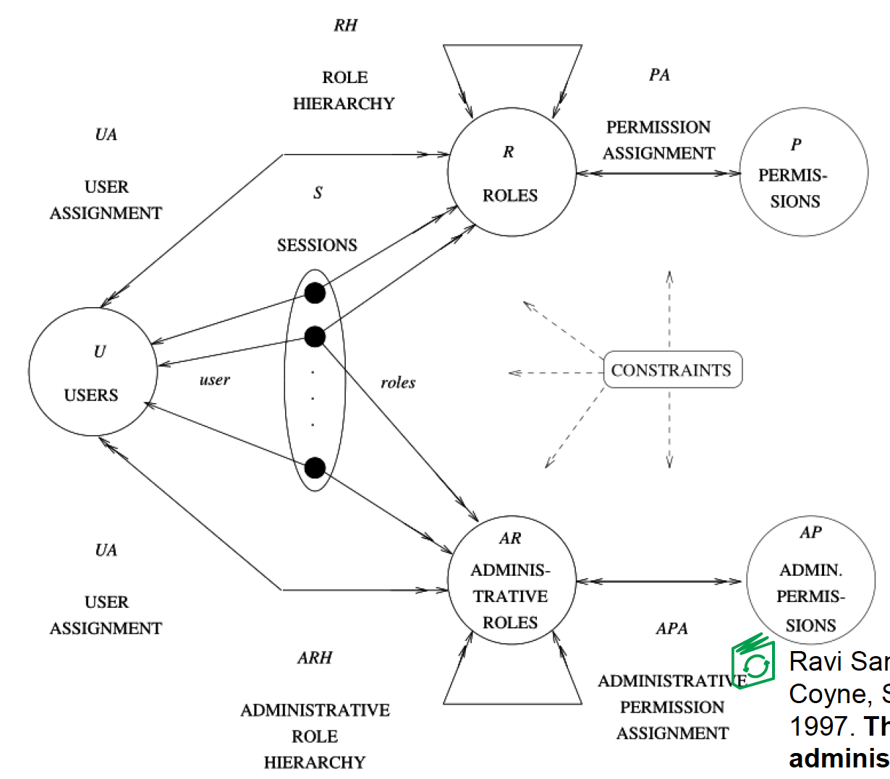

  - defines who is allowed to assign users to roles

  - assembles roles to **role ranges**

  - enables prerequisite roles for administrative roles

  - can-assign $\subseteq AR \times CR \times 2^R$ 

  - Can-revoke $\subseteq AR \times 2^R$ 

    - assignment rights independent of revocation rights

- **Role Engineering**

  - Process of determining the role-configuration for any RBAC system
    - Roles
    - User to Role Assignment (UA)
    - Role to permission assignment (RA)
  - several approaches are possible
  - **Role Mining (Bottom Up)**
  - Role Mining as Optimization Problem
  - $\delta​$-approx. RMP
  - Minimal Noise RMP
  - RMP is NP-hard
  - RMP can be reduced to Boolean Matrix Decomposition (also NP-hard)

## 4 Attribute based Access Control (ABAC)

- **ABAC**

  - A logical access control methology where authorisation is determined to **perfomr a set of operations by evaluating attributes associated with the subject, object, requestd operations, and, in some cases environment conditions against policy**, rules or relationships that describe the allowable operations for a given set of attributes*

  -  Current status
  -  Architecture
  -  Formal definition
  -  Combination with XACML

- Deployment

  - 4 phases to ABAC

    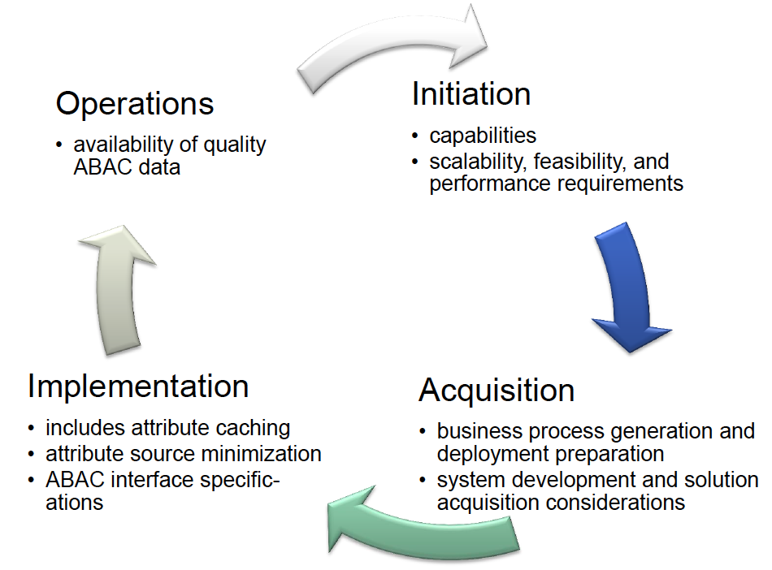

  - Questions you have to ask yourself during a phase:

    - **Initial**
      - What are the important benefits?
    - **Acquisition**
      - Are access rules and policies fully understood and documented?
    - **Implementation**
      - How are subject attributes managed for disconnected bandwith-limited or resource-limited users? 
    - **Operations**
      - How can attributes and the access decisions be monitored? 

- Delegation

  - Challenges with the flexibility of ABAC


XACML - Policy Structure 

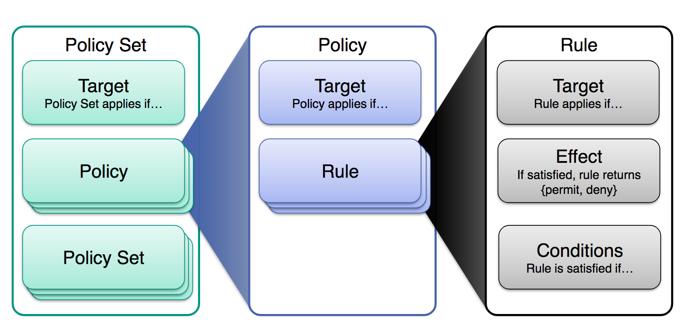

XACML components: Policy Enforcement Point (PEP), Policy Decision Point (PDP), Policy Administration Point (PAP), Policy Information Point (PIP)

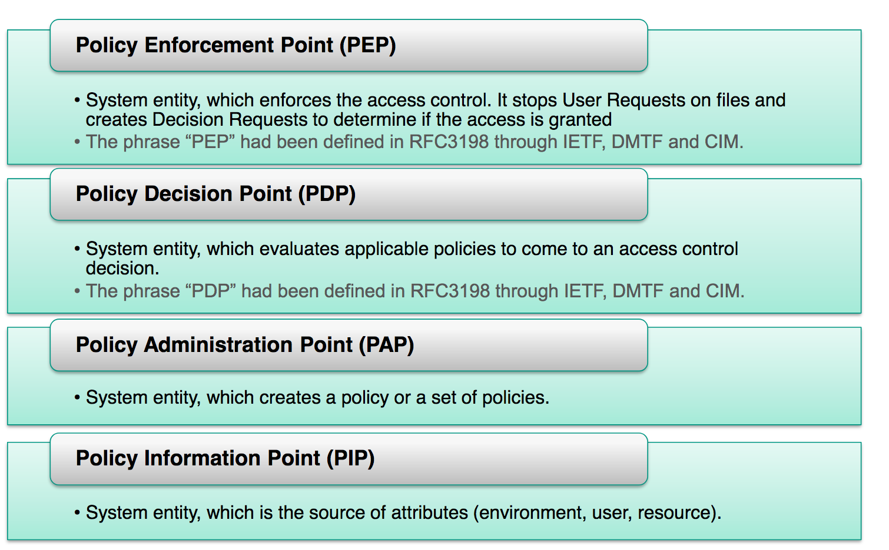


XACML- Flow

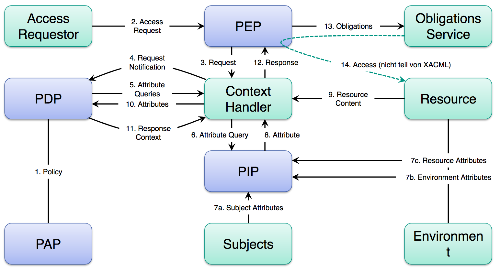


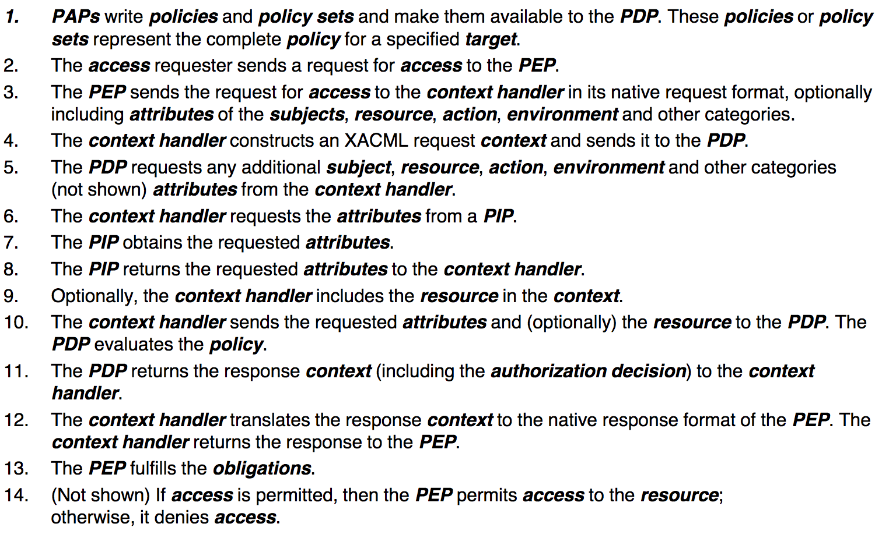


Access Control Models

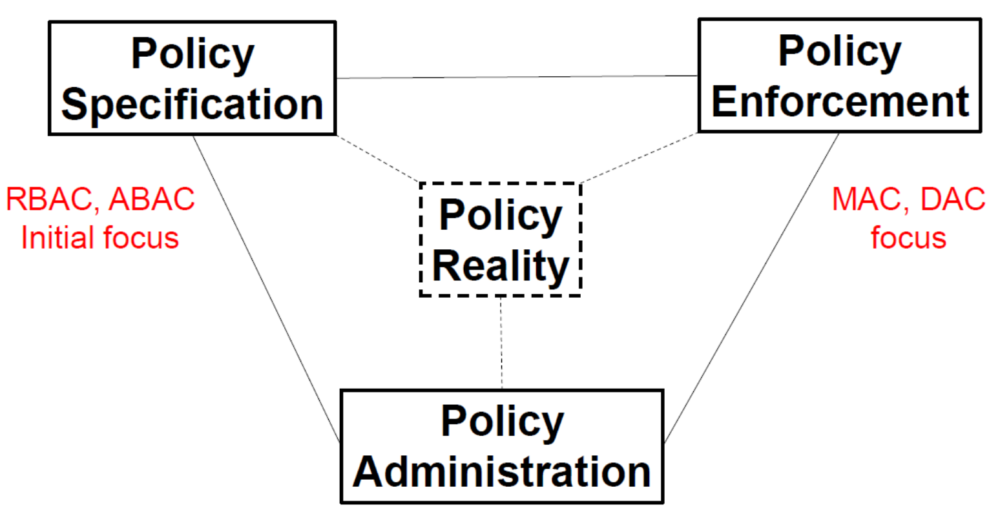


Authorization Leap

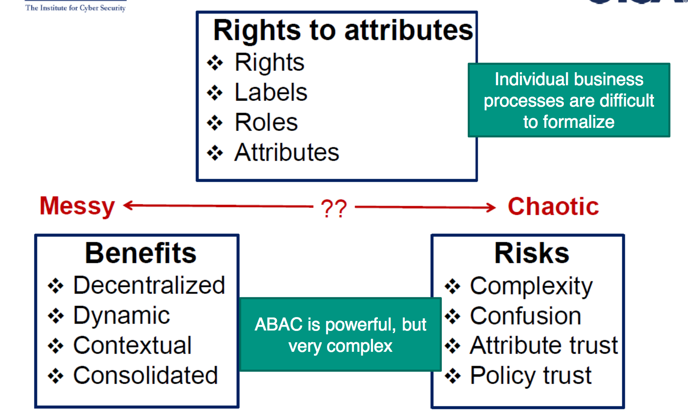


ABAC Architecture (ohne Management-Instanzen)


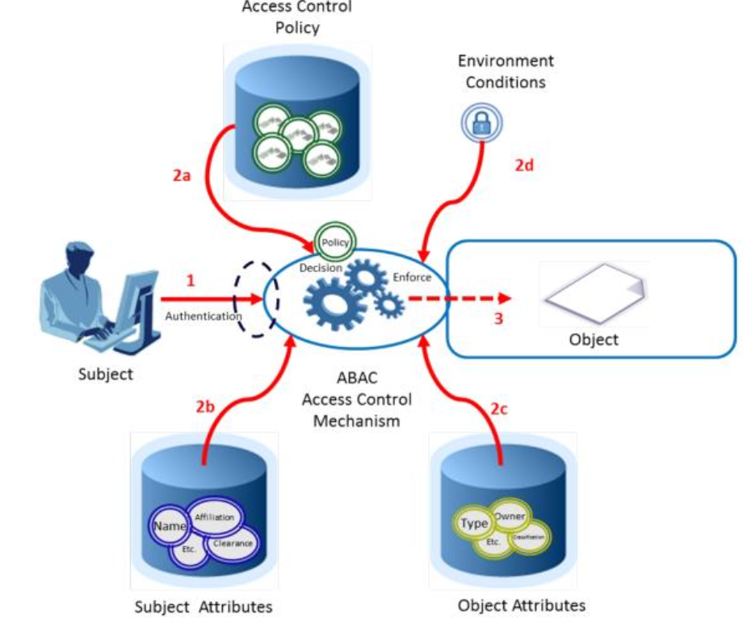

#### Delegation

Delegation enables a user to temporarily and dynamically alter the design of an access control system after policies have been created to account for everyday changes that policies are insufficient (mangelhaft) to address.

3 Components:

- Delegator (Who is doing the delegating?)

- Delegatee (Where are the elements delegated to?)

- Delegated access right (what is beeing delegated?)


In contrast to DAC, MAC, RBAC in ABAC systems Delegation is more complicated, because we can not only delegate permissions, but also attributes (identity less access control)
- Forms of Delegation:
  - Attribute Delegation (analogy: give someone your keycard to open a door)
  - Permission Delegation (Give someone's keycard the permission to open the door)
  - Group membership delegation 


Issues of Delegation:
-  Attribute Delegation: easy to implement and to use but very complex; maybe many unexpected attributes in system
-  Permission Delegation: very complex to implement because more system knowledge is necessary; harder to set up; No unexpected or undefined attribute sets due to no attribute delegation

## 5 Relationship Based Access Control (ReBAC)
- Access Control based on social relationship

- **Unterschiede zum klassischen AC**
  - policy individualization
  - User and Resource as a Target
  - User policies for outgoing and incoming actions

- Model Components:

  - Data Model

    - Directed Graph (Nodes U = Users, Edges R = Relationships)

  - Policy Description Language:

    |                 | Data Model                               | Policy Description Language              |
    | --------------- | ---------------------------------------- | ---------------------------------------- |
    | Expressiveness  | Should model relationship between users, and users & resources | Common Policies should be  expressible   |
    | Performance     | Should be efficient to process           | Evaluation of policies should be fast    |
    | Maintainability | changes to relationship should be frequently made | -                                        |
    | Usability       | -                                        | Policy should be easy to understand, create and maintain |


- Access req can be seen as a triple <$u_a$ , action, target> 
  - $u_a$ accessing user
- Conjuntion and disjunction of policies are possibilities for policy conflict resolutions
- Policy Specification
  - **operate on the user graph**
  - operate in most cases on path between u_a and u_t
  - Specification with multiple relationship types (friends, coworker)
    - ff and fc
    - e.g. Using regex: $ff\wedge \neg fc$ means 
      - friends of friends should see my pictures, but not if they are also a coworker of one of my friends
        - **-> Expensiveness** - Regex based on policy description is expensive
        - -> **Performance** - Social graphs can be really large and can be DoS Vulnerable
        - -> **Usability** - most users are unable to use correctly Facebook's privacy selection
- Combinations of ABAC and ReBAC possible: Node attributes and Edge attributes
- Algorithms in access control operate on data:
  - RBAC: roles, users, permissions and mappings
  - ABAC: attributes , users, permissions and mappings
  - ReBAC: Usergraph + X (Path traversal algorithms)

## 6 Values

- **Value**: What a person or Groupon of people consider important in life.
- **Norms**: Prescriptions/restrictions on action
- **Design Requirements**: technical properties of the considered system  
- Encoded in Law: Life, Liberty, Privacy (protection of personal data)
  - Grundgesetz: Menschenwürde, Freie Entfaltung der Persönlichkeit
- **Value-Sensitive Design (VSD)**
  - Goal: account for human values in a principled and comprehensive manner throughout the design process
  - Tripartite methology (Evaluierung & Selektion des Sys-Designs)
    - **Conceptual investigations** - Stakeholder und deren Werte identifizieren
    - **Empirical investigations** - In Konflikt stehende Werte priorisieren (Ziele setzen)
    - **Technical investigations** - Welchen Effekt hat das System auf die Werte? z.B. Bilder dauerhaft speichern, also nicht löschbar?
  - Combination of all three: evaluation/selection of a system design according to stakeholders


- ​

  - Upwards: design requirements can adhere to or violate norms, norms can support or hinder values
  - Downwards: norms specify values, design requirements specify or implement norms
  - Design process can be performed **top-down** or **bottom-up** or **both**
  - Mapping to OM-AM

  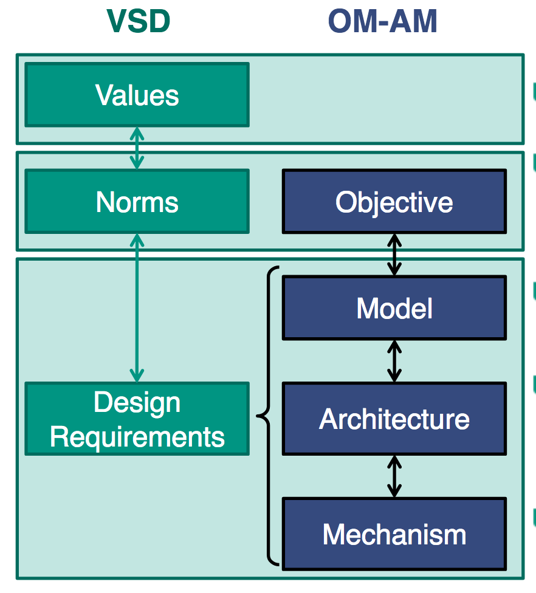

  - **Objective** - e.g. no unauthorised access
  - **Model** - Mathematical formalization of the objective, e.g. RBAC
  - **Architecture** - Logical components (e.g. auth/authoriz. servers) and interdependencies
  - **Mechanism** - Protocol and software implementations e.g. OAuth
  - OM-AM enables closer specification of "design requirements"


- "Private sharing"
  - Use case: A resource owner (RO) stores data at a storage provider (SP, eg Dropbox) and grants access to certain clients
  - Design decisions:
    - Authentication performed by an IdP, SP or RO?
- Decision making in Value-Sensitive Design
  - Basis for comparison 
  - Decision making under value conflicts and tradeoffs
    - Cost-benefit analysis
    - Direct trade-offs
    - Maximin
      - Maximize the value with the lowest measurement
    - Satisfaction 
    - Judgement
    - Innovation
  - Relationship to well known mathematical problems 
- Value-Scoring


#### Summary

- Impact of access control systems on many aspects of life
- Value notions
- "Value, norms, design" requirement framework
- Mapping to OM-AM framework
- Handling of value conflicts trade-offs
- Example of basic decision making in value-sensitive design
- **Challenges** 
  - Clarification of terms: what is meant by "safety" $\rightarrow$ requires discussion among stakeholders
  - Value commensurability, e.g. linear relationship between value units? How to handle diminishing returns, thresholds, incompatible design requirements?


## 7 Cloud 

- **AC in Cloud Systems**

  - Cloud computing is a huge market (75% of surveyd companies have a significant amount of their IT in the cloud already)
  - Cloud env bring their own set of requirements and usage scenarios
  - Environment: *Customisable Access Policy Groups, System Admins, Cloud Apps*  
  - **Problems**
    - Can we use *RBAC*? -> No:
      - **Cloud** resources and services tend to be very **dynamic**, due to the ease of service deployment (Software-as-a-service)
      - Variety of trusted domains offer a variety of services (even in different countries with different set of laws)
      - Sharing resources among potential untrusted tenants
      - Mechanism to support the transfer of customers credentials to access services and resources 
    - We need flexibility and a dynamic approach
    - -> *ABAC*? No! complexity is already difficult to handle in a closed system
  - **Requirements**
    - Dynamic performance and mobility features
    - Trust - Trust relationship between customer and cloud provider
  - **Solutions**
    - AC3
    - HASBE
    - Some approaches, like DAC-MACS implement cryptographically enforced ac, which belong to the area of Secure Data Sharing
    - **Solution is somewhere between RBAC and ABAC located**

- **A quick look into the on-premises ACS used at KIT**

  - **Directory Services**

    - Special purpose directory for naming
    - Quieries based on attributes
      - Compare: DNS requests
    - ***X.500*** traditional directory service
    - ***LDAP*** - Lightweight Directory Access Protocol
    - Example for X.500 & LDAP
      - Basic data set in database directory: (Attribute, Value)-Pair
      - (Organisation, Karlsruher Institut für Technologie), (OU, Telematik), (Name, Max Mustermann), (EMAIL, maxmustermann@kit.edu)
    - A Data set can also be a container to reference other directories or data sets -> hierarchical order

  - **LDAP**

    - Defines objects and their attributes as well as formats and the hierarchical order of elements
    - Comparable to the schema of SQL databases

  - **Foundations of Active Directory (AD)**

    - 95% of the Fortune 500 companies use AD in some kind of way

    - Umbrella title for many different services

    - Has Information about all internall information in an organization's network(users, printers, computers …) 

    - *Main Parts*:

      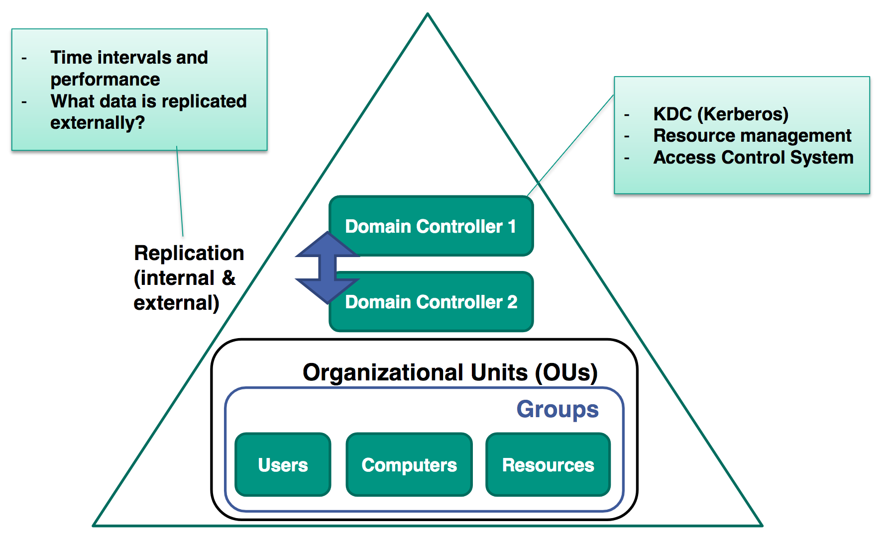

    - **Domains and Trusts**

      - Logical and administrative grouping of objects
      - Trsuting only in Domain Tree
      - **Domain Controller** 
        - responsible for al authentications and authorisations, additions, deletions and modifications inside a Domain
      - **Organizational Units**
        - can only appear inside a Domain
        - unique inside a domain
        - Team, Department or Location
      - Domain cannot be moved into or out of forests

    - **Forests**

      - Highest level of security boundary
      - To communicate information between different trees manual created Forest Level trusts are required
      - Schema is consistant through out the forest 

    - Sites and Forests

    - Operation Master Roles

      - Forest Level (1 per forest)
        - Schema master
        - Domain naming master
      - Domain Level (1 per domain)
        - Primary domain controller emulator
        - Infrastructure master


  - **Limitations of local AD**
    - AD designed for internal on premise environment
    - Can only be connected to outward services either fully open or fully manual (both undesireable in cloud env)
      - *fully open*: information in many cases critical and cannot be shared with other services
      - *Fully manual*: Cloud envs are too dynamic to set up every access right to any resource within AD
      - Identity Federation, SSO and many req can be only realized poorly

- **Windows Azure Active Directory** (WAAD)

  - **Overview**
    - Implemented as a "road towards the Azure cloud"
    - Works as a mediator between AD and Cloud  services -> makes it easier for businesses
    - Internal architecture changed significantly from a single hierarchy to a module-based framework
  - **Dynamic group members**
    - Some ABAC features for an RBAC model
    - Can be used like normal groups, but members are dynamically selected based on rules
    - $\rightarrow$ Enables ABAC to a certain degree, without adding too much complexity
    - Only user attributes available (no object or environment attributes), therefore also no attribute authority is needed, since the AD schema already defines all user attributes 
    - Sample rules: 
      - (user.department -eq "Sales") -or(user.department -eq "Marketing")
      - (user.department -eq "Sales") -and -not (user.jobTitle -contains "SDE")


- - ## 8 Digital Rights Management (DRM)  

- **Digital Rights Management**

  - **Relation to access control: conditional access systems**

    - Urhebergesetz §52a VGWort

    - Protects the tangible or fixed expression of an idea -> NOT the idea itself!

    - Author/Creator can claim copyright if the **two conditions** are fulfilled:

      - **proposed work is original**
      - **Idea is put in a conrete form (hard copy like paper, software, mulitmedia)**

    - DRM refers to controlling and managing digital intellectual property rights

    - Holders of digital rights should be clearly identified and should get the stipulated payment for their work

    - Components: *Clearinghouse, Consumer, Distributor, Content provider*:

      ​

    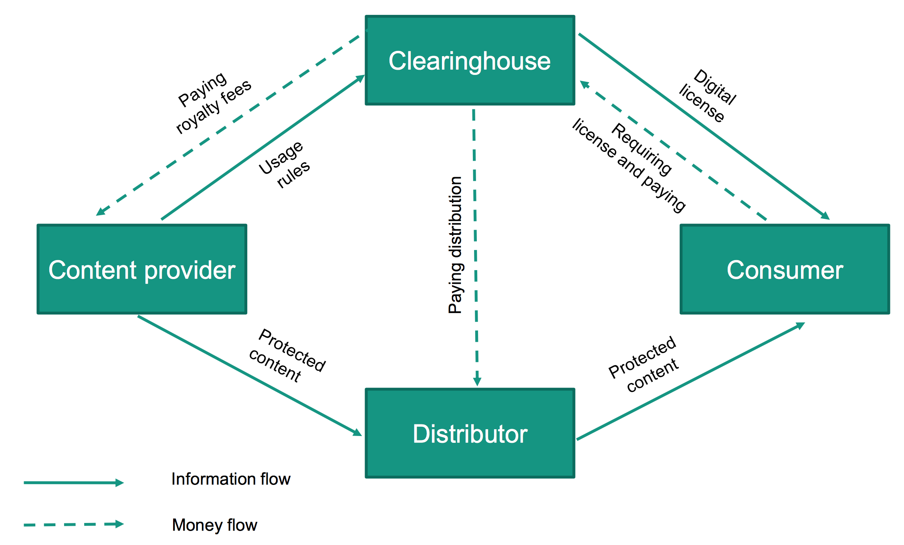

  - **DRM architecture**

    - **Roles**: *Rights Holders*, *Service Providers*, *Customers*

    - **Services**: *Identity Management, Content Management, Rights Management*

    - **Functions**: *Security/Encryption, Authentication/Authorization, Billing/Payments, Delivery*

    - Example: Microsoft PlayReady

       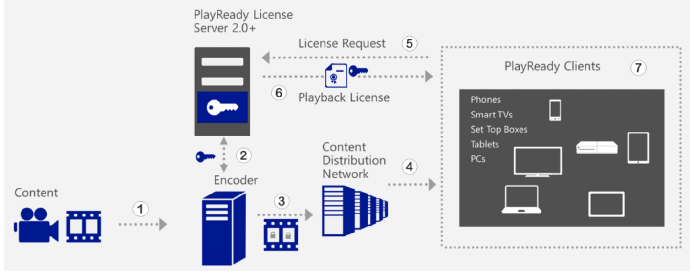

           1. Content is encrypted
           2. Encrypted key is available to the license server
           3. content is staged for delivery
           4. Client discovers content
           5. To encrypted content client sends a license request to license server
           6. Server authenticates client and issues license to client
           7. Clients plays unencrypted content back according to policies defined in license. For example restricting playback to a secure HDMI port to safeguard against copying

- Usage control

  - Term generalization of access control

  - Covers:

    - Authorisations
    - Obligations
    - Conditions
    - **Continuity **: Decision to allow access is not only made prior to access, but also during the time interval that access takes place
    - **Mutability** (Erweiterbarkeit): allows certain updates on subject or object attributes as side effect of usages

  - Unified Framework for DRM and access control

  - UCON model

    - provides family of core models for usage control 

    - **sensitive information protection** has been one of the most important goals of traditional access control

    - Park/Sandhu $UCON_{ABC}$, 2004

       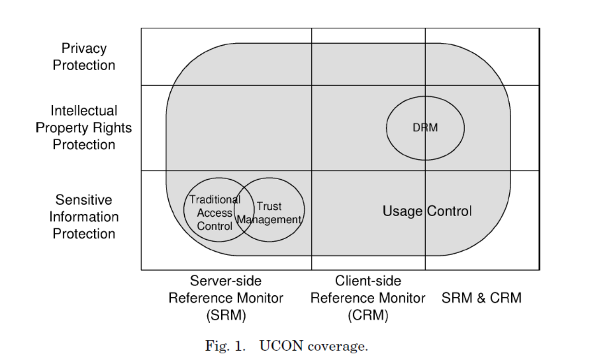

  - UCON vs traditional Access Control Models

    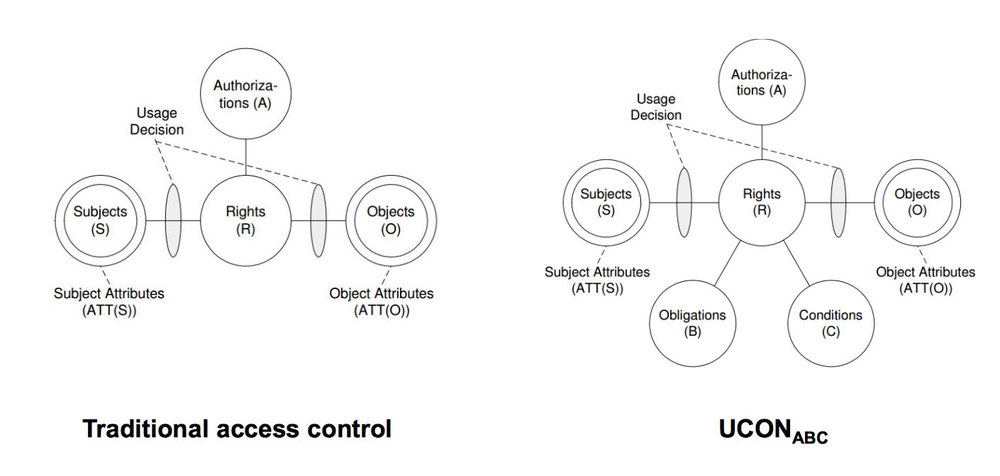

    ​

  - There are familiar concepts at $UCON_{ABC}$ to attribute-based access control

  - Components of UCON

    - **Subjects (S)** and Subject attribute (ATT(S)): *S=user, ATTS={user_group}* 
    - **Objects (O)** and Object attribute *(ATT(O)): O=file, ATTO={security_level}*
    - **Rights (R)**: R=read
    - <u>**Authorizations(A)**</u>: preA and onA
      - functional predicates that have to be evaluated for usage decision and return whether the subject (requester) is allowed to perform the requested rights on the object	
    - <u>**Obligations(B)**</u>: preB and onB
      - functional predicates that verify mandatory requirements a subject has to perform before or during a usage exercise
      - Beispiele: 
        - preB: Formular ausfüllen oder AGBs akzeptieren bevor man den Service nutzen kann	
        - onB: Ansehen von Werbungen während einer Session, in der er eingelogged ist
    - **<u>Conditions(C)</u>**: preC and onC
      - Conditions are environmental or system-oriented decision factors - z.B. Location checking

  - UCON_ABC family of core models

    - Nutzen von Mutability of attributes

    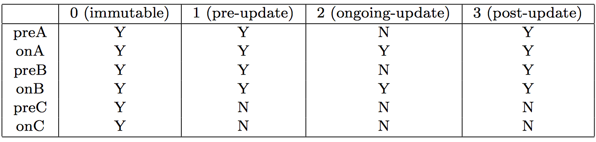

  - Examples:

    - preA0: Authorization is taken before access is allowed, no attributes changed
    - preA1: preA0 + preUpdate(ATT(s)), preUpdate(ATT(o))
    - preA2: preA0 + postUpdate(ATT(s)), postUpdate(ATT(o))
    - MAC: UCON model preA0
    - DRM pay-per-use with a prepaid credit: UCON model preA1
    - DRM membership-based metered payment: preA3
    - UCON model onA13: A limited number of simultaneous usages, revocation using usage start time
    - UCON model preB0: A license agreement obligation, every time
    - onB0: Watch ad windows while s exercises r
    - preC0: Location limitation
    - onC0: Time limitation
      - Workflow example:
        - A medical doctor (s) can perform (r) an operation (o) only if he has performed operations more than 3 times
          - …and only if patients agree on a consent form

    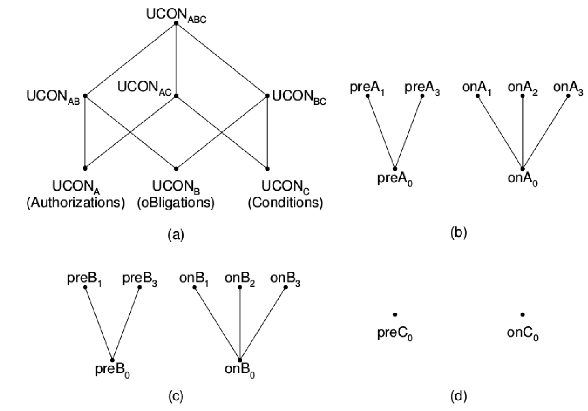

  - **Administrative model**

    - Unlike immutable attributes, mutable attributes are modifiable as a consequence of subject's actions -> do not require administrative action for update
    - Distinguishes between providers, consumers and Identify subjects -> Baseline setup for IoT scenarios
    - $UCON_{ABC}$ model seperates core models from administrative issues


​	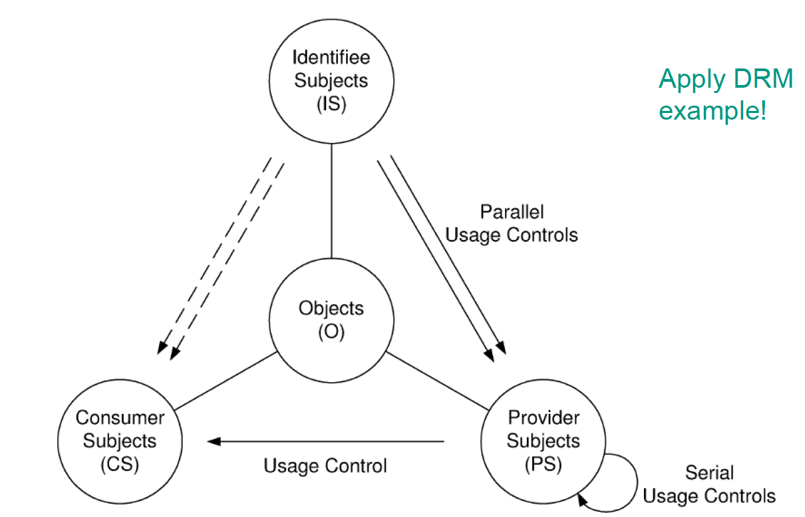

- **Important Key notes**
  - DRM refers to controlling and managing rights to digital intellectual property
  - Usage control provides a 'unified framework' for DRM and access control
  - UCON$_{ABC}$ provides a family of core models for usage control
  - Admin model distinguishes between providers, consumers and Identifiee subjects -> baseline setup for IoT scenarios 

## 9 The Internet of Things - IoT

- **Motivation**

  - Devices often operate in "untrusted environments" (mobile, cloud, IoT, IoE)

- Securing the Internet of Things is very important

- Problems: Vehicle hacking, hacking smart buildings, printing and copiers

- Embedded devices, safety relevant, critical infrastructures

- Issues: Authenticity and integrity 

  - change in scale, criticality complexity 

- **Smartcards**

  - ISO 7816 - Identification cards
  - ISO 14443 - contactless integrated circuit cards
  - Memory cards

  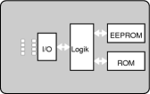

  - Microprocessor cards

    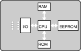

  - Example: <a href="https://de.wikipedia.org/wiki/Mifare">Mifare Classic</a> (known hack on it)

  - **Typical security features**

    - *Tamper proof design*:
      - Manual chip layout
      - Mechanisms against various attacks
        - physical attacks of various forms
        - freezing the device
        - applying unusual clock signals
        - inducing software errors using microwaves
    - Security logic and card os might be in mask ROM
    - PIN/PUK mechanisms
    - Access Control for file system

- How to establish trust in "untrusted environments" -> Trusted Computing (TC)

- **Trusted Computing**

  - A technology which is taken from the field of *trusted systems* where the computer will consistently *behave in expected ways* 

    - Behavior will be enforced by *hardware* and *software*
    - Behavior is archieved by loading the hardware with a unique encrypted key
    - the encrypted key is unaccessable to the rest of the system
  - Controversy: 
    - hardware is not only secured for its owner &rarr; also secured **against** its owner!
  - **Key concept**:
    - **Endorsement key** &rarr; *chip gets identity* (key on CPU)
    - **Secure input/output** &rarr; hinders attacks like key-stroke loggers and screen scrapers
    - **Memory curtaining /protected execution** &rarr; strong memory isolation (also OS & Debugger can't read)
    - **Sealed storage** &rarr; allows software to keep cryptographically secure secrets
    - **Remote attestation** &rarr; software gets identity (trusted device knows which software is running)

- **Access control in vehicles**

  - Connected with personal devices, other cars, road operators

  - Various wireless interfaceses &rarr; Simplified accessibility by attackers

  - *Coarse-grained view*:

    - Protection against external attacks
    - Protection of personal data

  - Challenges

    - Extensive (wireless) interfaces

    - Interaction with its environment &rarr; which information should we trust?

    - Communication between vehicles

- **Intra-vehicle Networks**

    - Requirements
        - **Confidentiality** (sw-updates confidential) , **integrity** (no authorized change), **availability** (functions and network available all time), **authenticity** (devices should be who they claim), **non repudiation** (changes to system needs to be accountable), **privacy** 

      - **Architecture **
        - Multitude of different bus systems & protocols
        - connected to each other via a central gateway
        - remote access possible

      - **Achieving security**
        - Hardware Security Modules (HSM)
          - protect sw security measures by acting as trusted security anchor
          - Securely generate, store, and process security-critical material shielded from any potentially malicious sw
          - Hue design space of HSMs regarding:
              - Processing power
              - Crypto engines
              - Random number generator
              - Secure Clock
              - Key management
          - Requirement: Security must not be a bottleneck

- **Security in inter-vehicle networks (C2X)**

  - Two issues of security: Cost and privacy 
  - Possible attacks: Bogus Attack, DDos, Interception, ...
  - Security goals: Integrity, Availability, Authenticity, ...

    - However: Confidentiality generally not
  - Ensure integrity and trustworthiness of C2X messages for digital signatures
  - Asymmetric crypto
  - Approaches for communication:

    - Outgoing transmissions are signed and a certificate is attached

    - Idea: Use of **pseudonyms**

      - *Time limited* - prevents location tracking

      - *Uniqueness* - avoid multiple vehicles with same pseudonym 

      - *Availability* - possibility to store plenty of pseudonyms locally
  - Lifecycle of pseudonym
      - **Issuance** (based on long-term vehicle id number) &rarr; **use** (entails authentication of two transmissions)  &rarr; **change** (of ids - pseudonym, IP, MAC - has to occur simultaneously) &rarr; **resolution** (of misbehaving nodes) &rarr; **revocation** (of pseudonyms)
  - Cost of security - payload: Sum 255 Bytes transmission overhead
      - large propotion of transmission time for security

- **Important key facts**

    - IoT already there (smartcards), dramatic increase in scale and complexity
    - TC &rarr; mechanism to enforce access control exist, but when chips and sw gets 'ids' for access control, there are issues with privacy and freedom  &rarr; value conflicts 
    - **Intra-vehicle network**
        - Quite obvious on how it could be done (tc), quite obvious that it is not the case today 
        - Trade-offs between trust, performance, deployability
        - Access control specification and administrative models still work in progress
    - **Inter-vehicle network**
        - Two issues: cost and privacy
        - Pseudonyms, plausibility checks
    - &rarr; A lot of work to be done in the years to come (in research and development)
    - ACS require enforcement mechanism for authenticity , integrity, confidentiality, availability…anonymity, privacy &rarr; all the protection goals of information security
    - AC in a broader sense, therefore, covers all of info security


##10 Secure Data Outsourcing & Access/Pattern Confidentiality 		

- **Cryptographically enforced Access Control**
  - Before logically enforced access control &rarr; Based on trust
  - Trust not given between service provider and service consumer
  - no one (even the service provider) should acces our data in absence of trust &rarr; **Crypotographically enforced access control**
- **Secure Data Outsourcing **
  - **Advantages**:	
    - Cost
    - Availability and Scalability
    - Administration
  - **Disadvantage**:
    - *Data Confidentiality* (one of the Top-3 obstacles (Hindernis) for cloud computing)
  - **Content Confidentiality **
    - User do not trust DaaS (Database-as-a-Service) offerings and the storage provider behind that
    - Do not accept the company policies
    - Attacker that is able to access the storage of the outsourced database is not able to learn the content of the database's records
  - *Naive approach*: Encrypt data with probabilistic encryption scheme
    - Not able to query efficiently
    - Calculations on data are impossible
  - -> Encrypted index is needed (Searchable encryption)
  - Problems of encryption techniques
    - Inference attack on static data
      - Attack on deterministic encryption (DTE)
        1. Frequency sort
        2. compare with public data
        3. &rarr; plain text
      - Attack on order-preserving encryption (OPE)
        1. Frequency sort
        2. Aggregate data 
        3. Compare aggregated data with public data
        4. &rarr; plain text
      - Result: Age, Sex, race, probability of death and severity of illness could be inferred 
  - &rarr; Security has to be further analyzed and in some way measured
  - **Attacker Models**
    - Honest-but-curious attacker analyzing static data
    - More powerful: Honest-but-curious attacker access patterns of data
    - Most powerful: Attacker who has access to data and access patterns and additionally lets the client encrypt data
- **Access Pattern Confidentiality**
  - It is indistinguishable for an attacker:
    - *which parts of the db were accessed by a db operation?*
    - *whether specific data was repeatedly accessed*
    - *whether the db was queried or updated*
  - &rarr; No information leakage, even if series of accesses to same record
  - &rarr; Proposed Protocols: <a href="https://en.wikipedia.org/wiki/Oblivious_ram">oblivious RAM</a> (**ORAM**) and **Burst ORAM**
  - **ORAM**
    - Get and store operations &rarr; indistinguishable for attackers
    - ORAM is an interface between a program and the physical RAM
      - Performing a read (get) or write (store), does both at the same time on the physical RAM to hide if you are reading or writing. 
      - shuffles the memory from time to time &rarr; adversary seeing only accesses to the physical RAM cannot know whetever you accessed the same data twice or accessed two different data. **Thus hiding the access patterns to the physical RAM.**
  - **Burst ORAM**
    - Get: XOR of all blocks
    - Store: Shuffle jobs per partition
- Our research: ORAM for Databases 
  - &rarr; **PATCONFDB** (high query latency)
    - Use ORAM as a building block for confidentiality-preserving relational databases
    - Possible operations: selection, insertions, update and delete
    - For efficiently use of ORAM we need an efficient index structure for range and prefix selection &rarr; B-tree, layered architecture
    - Access a record: 
      1. Query the root
      2. Query ORAM index Layer 1 
      3. Query ORAM index Layer 2
      4. Query ORAM Record Store
    - **Every Layer is stored in a seperate ORAM instance**
  - Issues with multiple indices
    - Attacker can differentiate between euqality selections and insert/delete operations
      - solutions: 
        - Query every index for equality selection
        - &rarr; Poor performance, but selections are indistinguishable
    - Attacker can differentiate between equality selections and prefix/range selection
      - Solution:
        - Execute range and prefix selections as a sequential series of equality selections 
        - &rarr; Poor performance, but selections are indistinguishable 
    - Attacker can differentiate between update and others
      - Solution:
        - Perform a 2nd query on Nav tree after every operation on database 
- **Important key facts**
  - Cryptographically enforced access control can be a good alternative for scenarios, in which there is no trust relationship between a service provider and a service user 
  - Access Pattern Confidentiality must be taken into consideration in almost all outsourcing scenarios 
  - The performance of proposed approaches improves quickly 
  - ORAM, Burst ORAM 
  - In database scenarios with multiple indices, several new problems are introduced when it comes to information leakage
  - Takeaway messages: 
    - Encryption is not sufficient in outsourcing many scenarios
    - Thinking about information leakage is a good excercise to evaluate the security of protocols

## 11 Secure Data Sharing

- External storage provider
  - **Advantages**:
    - Availability
    - Badwidth
    - Simple Administration
  - **Disadvantages**
    - *Confidentiality* and *Integrity* of data is threatened
  - In contrast to Data Outsourcing **sharing** is now an explicit requirement
  - Obvious solution: Data encryption &rarr; prevents server-side inspection and provides integrity 
    - But how to share encrypted data with others
- **Naive Key management**
  - Naive approach: provide the data key directly to others
    1. User A generates symmetric key
    2. Encrypts data with key 
    3. Stores data at the SP 
  - Con: revocation of access rights is expensive
    - create new keys
    - Re-encrypt data with new key and upload encrypted data
    - provide the new key to all users that are still authorized to access the data
- &rarr; Revocation is very expensive
- &rarr; key exchange using already exchanged keys
  - initial exchange of keys between users necessary
  - key for user data (and further keys) are encrypted using the initially exchanged keys and are stored together with the user data
  - exchange key can be symmetric or asymmetric
    - Exchange of symmetric key comparable to kerberos
      - Initial exchange of a keyphrase between user and authN and calculation of master key K$_A$ 
      - Session key S$_A$ is created by the KDC encrypted with K$_A$ and sent to the user
- **Lockbox**: encrypted key


- **Shared Cryptographic File Systems**

  - **Confidentiality **
    - **encryption/decryption on client-side**
    - **Only encrypted data stored on server**
  - **Integrity**
    - **Through signatures and Message Authentication Codes**
  - Possible implementations: 
    - own file system
    - Overlays to existing file systems
  - **SiRiUS**
    - Ensures **confidentiality** and **integrity** of data
      - First encrypt data and then sign data before upload to SP
    - Overlay of File System with metadata in metadata files
      1. *Create* symm FEK creation
      2. *Create* FSK$_{pub}$
  - **Boxcryptor 2.0**
    - **Confidentiality of data**
    - **Integrity of data is not ensured cryptographically**
    - Overlay to existing files system
      - transparent encryption in an additional layer of the file system
      - Metadata are partly stored with the actual data and partly at Boxcryptor‘s key server

  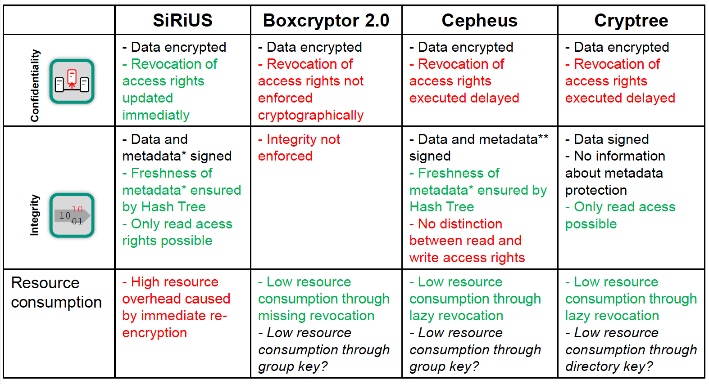

- Discussion:
  - The price of secure data sharing (performance)
    - Abstract representation via key graphs?		


## 12 Blockchain and Bitcoin

- **Human-readable Identities (Zooko’sTriangle)**

  - “Clients need to know the public key of the payee”				
  - Desired Properties
    - **Specificity**
    - **Memorability**
    - **Transferability**
    - **Decentralization**
  - Only choose three of the above properties:
    - No specificity: Name, Nickname
    - No memorability: Pub key hashes
    - No transferability: Locally stored pub key db
    - No decentralization: Domain names

- Observation so far: 

  - Bank can be run without identities 
  - Users use their pubkey as pseudonyms &rarr; good for privacy 
  - BUT: Users need to exchange their pseudonyms out-of-band and users have to trust the bank

    ​	
    ​